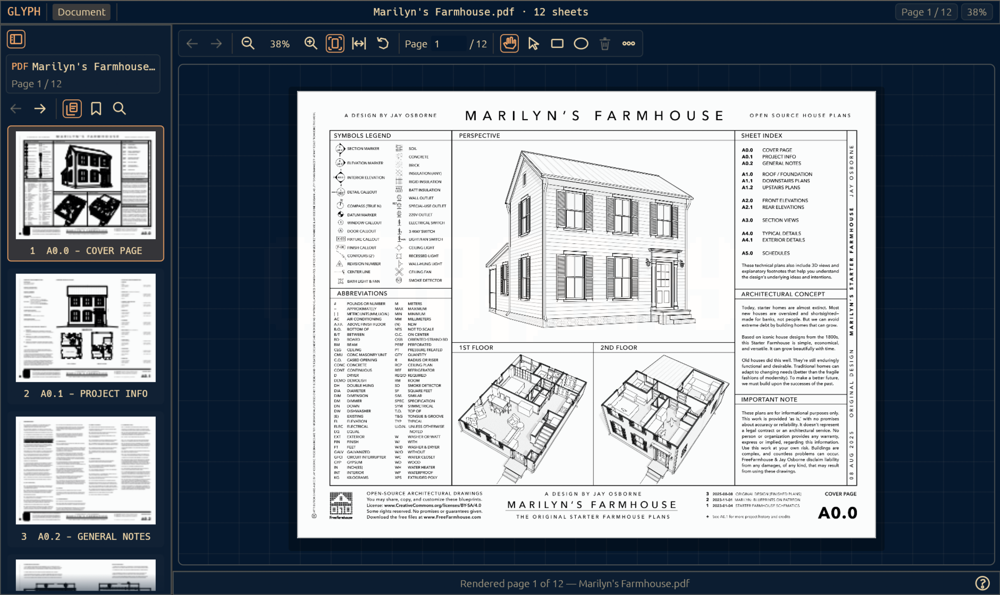

# Glyph

Glyph is a PDF editor for Arch Linux.

Glyph is a native Rust application built around a large PDF canvas, compact controls, keyboard navigation, and Omarchy theme integration.



*Glyph in use. Drawing: “Marilyn’s Starter Farmhouse” by Jay Osborne / [FreeFarmhouse](https://www.freefarmhouse.com), licensed under [CC BY-SA 4.0](https://creativecommons.org/licenses/by-sa/4.0/). Screenshot supplied by the project author.*

## Project status

The latest published release is [Glyph 1.5](https://github.com/dansc89/Glyph/releases/tag/1.5), for x86_64 Linux. It includes viewing/search, drawing-set navigation, rectangle/ellipse markup, bookmark-title and page-label editing, shared Undo/Redo, and guarded Save/Save As with backups.

Glyph is actively developed toward Drawbridge v5.5 feature maturity; **full parity is not yet achieved**. Line/Arrow tools have been verified in newer local development work, but are not included in the 1.5 downloads. Move/resize, editable stroke properties and searchable Go to Sheet are ongoing development, not released features. See [current capabilities and remaining gaps](docs/drawbridge-parity.md).

## Architecture

Glyph is **not** a web wrapper. It is a native Rust desktop app.

- UI: Rust native immediate-mode shell with `egui`/`wgpu`
- PDF inspection/write path: Rust + `lopdf` first, `qpdf` integration later for hard PDF rewrites
- Rendering path: PDFium via `pdfium-bundled`, embedded at build time so the app does not need a system PDFium install
- Development: native Rust builds/tests on an x86_64 Linux desktop; GitHub Actions produces Linux release artifacts

## Compact PDF-first UI

Release 1.5 adds explicit loading and save-stage feedback, renderer-failure recovery guards, reusable high-zoom pan tiles, and whole-word double-click selection. The compact PDF-first interface remains. See [`docs/releases/1.5.md`](docs/releases/1.5.md) for verification and limits.

## Viewer features

- Load a PDF by file picker, pasted path, drag-and-drop, or CLI argument (`glyph file.pdf`)
- Render the selected page with PDFium
- PDF outline/bookmark sidebar with one-click page jumps
- Page list/sidebar with previous/next navigation
- Drag to pan
- Scroll or +/- to zoom, Fit Page (`Ctrl+1`), Fit Width (`Ctrl+2`), Reset (`Ctrl+0`)
- Keyboard shortcuts: Ctrl+O, Arrow/Page keys, Home/End
- Native, theme-aware shell with dark and light Omarchy palettes

## Install on Arch Linux

Easiest path today:

```bash
curl -fsSL https://github.com/dansc89/Glyph/releases/download/1.5/install-glyph-arch.sh | sh
glyph
```

The installer creates a normal desktop launcher and a detached `glyph` wrapper. Launching from Terminal now returns control immediately; use `GLYPH_FOREGROUND=1 glyph` only when you deliberately want foreground logs.

AUR-style package recipes are included under `packaging/arch/`:

- `packaging/arch/glyph-pdf-bin/` — binary release recipe intended for AUR publishing as `glyph-pdf-bin`.
- `packaging/arch/PKGBUILD` — source checkout recipe for a future `glyph-pdf-git`/source package.

The plain `glyph` and `glyph-bin` AUR names are already taken by an unrelated ASCII-art project, so this app uses the clearer `glyph-pdf-*` package naming path.

Manual path: download `glyph-arch-x86_64.tar.gz` from the release, then run:

```bash
tar -xzf glyph-arch-x86_64.tar.gz
cd glyph-arch-x86_64
./install-glyph.sh
glyph
```

The AppImage is still published as an alternate portable artifact:

```bash
chmod +x Glyph-x86_64.AppImage
./Glyph-x86_64.AppImage
```

From a source checkout, the tarball installer source lives at `packaging/linux/install-tar.sh`.

If you only have the AppImage and your system does not have AppImage/FUSE support, use the included no-FUSE installer instead:

```bash
./install-glyph-appimage.sh ./Glyph-x86_64.AppImage
glyph
```

That extracts the AppImage payload into your user profile and installs a normal detached `glyph` launcher, so runtime launch does not depend on FUSE or keeping a Terminal window open. See [`docs/arch-linux-install.md`](docs/arch-linux-install.md) for the release packaging guarantee.

An Arch-friendly source package recipe lives at `packaging/arch/PKGBUILD` for later AUR packaging.

## Drawing-set features

The published release includes full-document selectable-text search (Ctrl+F), highlighted results, internal hyperlink navigation, optional link highlights, and Back/Forward history (Alt+Left/Alt+Right). Search runs in the background and can be cancelled; OCR is not yet implemented. The Pages tab has clickable, virtualized thumbnails. Drag over PDF text and use Ctrl+C to copy it; drag empty space or use the middle button to pan. Text extraction and preview rendering share the background renderer and use bounded resources.

The Auto Bookmarks action detects sheet identifiers from selectable title-block text, rather than PDF page numbers. The Hyperlinks action matches exact cross-sheet references and skips self-links and ambiguous destinations. Both actions run in the background, show completion/no-op/error feedback, and save uniquely named copies without overwriting the source or previous exports. Scanned PDFs require OCR, which is not implemented. Generated links are idempotent and existing annotations are retained. Auto bookmarks replaces the saved copy’s existing bookmark hierarchy; the source hierarchy stays untouched. Sheet naming is heuristic: equally supported IDs stay undetected, and fallback page names never become hyperlink targets.

Flatten is temporarily disabled: the former implementation removed annotations rather than preserving their appearance. Do not use it as a flattening solution.

The supported Drawbridge parity target and outstanding gaps are tracked in [`docs/drawbridge-parity.md`](docs/drawbridge-parity.md). Release 1.3 adds native rectangle/ellipse markup, bookmark-title and embedded page-label editing, shared Undo/Redo, and guarded Save/Save As with backups. See [`docs/releases/1.3.md`](docs/releases/1.3.md) for verification and remaining limits.

## Markup and save

Use `R` for rectangles, `E` for ellipses and `V` to select owned markups; Delete removes the selected shape. `Ctrl+Z` / `Ctrl+Shift+Z` undo/redo and `Ctrl+S` saves. Unsaved edits stay in memory; Save verifies a staged PDF before atomic replacement and retains a backup. Save As refuses collisions. Bookmark titles and page labels share the edit history. Imported annotations are preserved, not automatically made editable. Stroke is currently red/unfilled/2 pt; further tools, manipulation and styles remain pending.

## Omarchy integration

Glyph follows Omarchy's active colors (including light themes) and refreshes when the theme changes. It reads the staged palette under `$XDG_STATE_HOME/omarchy/current/theme/colors.toml`, defaulting to `~/.local/state/omarchy/current/theme/colors.toml`; it does not change desktop settings. The Wayland app ID matches `glyph.desktop`. Fit Width (`Ctrl+2`) top-aligns tall sheets; Fit Page (`Ctrl+1`) and Reset (`Ctrl+0`) work even while the search field has focus. Fitting is unavailable while inspecting a newly opened document. Fit modes now follow resizing and sheet changes until you zoom, pan or reset. Back/Forward restores the viewport as well as the page. Use `Ctrl+G` to enter a page number directly. Wheel zoom integrates input distance rather than smoothing-frame count.

## Performance

The viewer uses a retained PDFium session, bounded render scheduling, shared raster/texture caches, virtualized sidebars, background document inspection, and preserved zoom/pan when navigating sheets. Benchmarks, verification commands and limitations are in [`docs/performance.md`](docs/performance.md). Use the optimized `target/release/glyph` build for normal use, not the debug build.

## Product roadmap

The living usability and feature roadmap is in [`docs/product-roadmap.md`](docs/product-roadmap.md).

## Releases

Public releases use a simple numbered train: `1.0`, `1.1`, `1.2`, `1.3`, ... even for small incremental updates. See [`docs/release-policy.md`](docs/release-policy.md).

## Build locally

```bash
cargo test --locked
cargo run --release --locked
cargo run --release --locked -- /path/to/file.pdf
```
